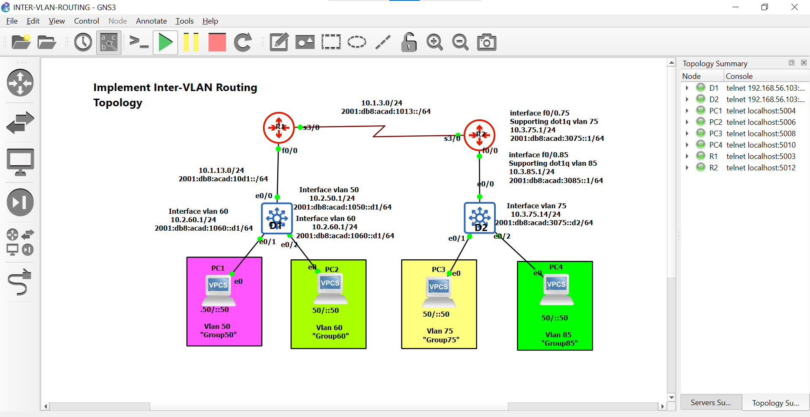

# 🚀 Ndaye Network Projects – CCNP Level

Welcome to my network engineering portfolio.

I design and implement real-world enterprise network labs using GNS3, focusing on routing, security, and scalable network architectures.

---

## 💡 About Me

I am passionate about network engineering and cybersecurity, with hands-on experience in building and securing enterprise infrastructures.

💡 My goal is to become a skilled Network Engineer capable of designing, deploying, and securing modern networks.

---

## 🔥 Highlights

- 🔐 Secure VPN (IPsec, VTI, GRE)
- 🌐 Advanced Routing (OSPF, BGP, Static Routing)
- 🛡️ Network Security (ACL, SSH, NAT/PAT)
- ⚙️ Automation (Python, Netmiko)
- 🖥️ Virtualization (GNS3, IOU, VPCS, QEMU)

---

## 🚀 Projects

### 🔐 VPN IPsec VTI (Enterprise Lab)

Secure site-to-site VPN using IPsec Virtual Tunnel Interface (VTI) with dynamic routing.

✔ Encrypted communication between HQ and Branch  
✔ OSPF routing over IPsec tunnel  
✔ Enterprise-level network simulation  

👉 [View Project](./01-VPN-IPsec-VTI)

---

### 🌐 Static Routing Lab

Implementation of advanced static routing techniques in IPv4 and IPv6.

✔ Floating static routes (failover)  
✔ Null routes for traffic control  
✔ IPv4 and IPv6 configuration  

👉 [View Project](./📁%20PROJET%2002%20–%20ROUTAGE%20STATIQUE)

---

## 🖼️ Sample Topology

---

## 📊 Network Skills Demonstrated

- **Routing**: OSPF, BGP, Static Routing, Redistribution  
- **Switching**: VLAN, Inter-VLAN, EtherChannel, STP  
- **Security**: IPsec VTI, ACL, SSH, NAT/PAT  
- **Services**: DHCP, NTP, SNMP  
- **Automation**: Python, Netmiko  

---

## 🚧 Upcoming Projects

- 🔁 OSPF Advanced Lab (multi-area, optimization)  
- 🌍 BGP Multi-site Network  
- ⚡ HSRP / High Availability  
- 🔐 Network Security Hardening  

---

## 📫 Contact

- 💼 LinkedIn: [Patrick Ndaye](https://www.linkedin.com/in/patrick-ndaye-b5b67a399)  
- 📧 Email: patrickndayae919@gmail.com  
- 📱 WhatsApp: +243975659129  

---

## ⭐ Support

If you find this repository useful, feel free to give it a star ⭐  
and connect with me on LinkedIn!
